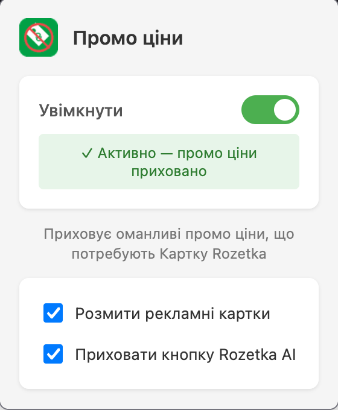

# Promo Price Hider

Firefox extension that hides misleading promo prices on Rozetka.com.ua that require a payment card. Shows you the real prices you can actually pay.

## What it does

- Hides red promo prices that require Rozetka's payment card
- Hides "Картка Rozetka" promo banners
- Optionally blurs advertisement tiles
- Optionally hides AI chat button

## Install

[**Firefox Add-ons**](https://addons.mozilla.org/uk/firefox/addon/promo-price-hider/)

### From source (for testing)

1. Open Firefox → `about:debugging` → "This Firefox" → "Load Temporary Add-on"
2. Select `manifest.json` from this folder
3. Visit rozetka.com.ua to see it in action

Temporary extensions are removed when you close Firefox.

### Permanent

1. Build the extension:
   ```bash
   web-ext build
   ```
2. In Firefox, go to `about:addons` → gear icon → "Install Add-on From File"
3. Select the `.zip` from `web-ext-artifacts/`

## Screenshot



## Usage

Click the extension icon in the toolbar:
- **Увімкнути** — main toggle to enable/disable
- **Розмити рекламні картки** — blur advertisement tiles
- **Приховати кнопку Rozetka AI** — hide AI chat button

## Note

This extension relies on specific DOM structure and CSS class names of the website. If the website updates its markup, the extension may stop working and will need to be updated accordingly.

## Files

- `manifest.json` — Extension configuration
- `content.js` — DOM hiding/blurring logic
- `background.js` — State management and badge updates
- `popup.html/js` — Popup UI
- `icon-48/96/128.png` — Extension icons

## License

[MIT](LICENSE)
